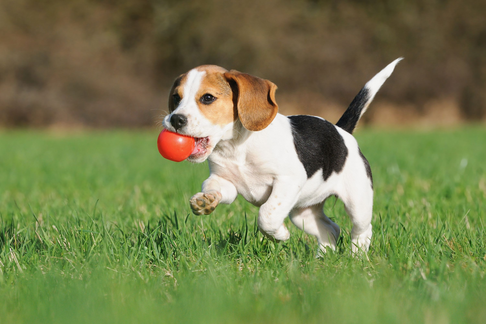

# Cloudinary's Guess the Transformation Challenge: JAMstackConf London 2019

### This challenge involves guessing a Cloudinary transformation URL that produces a given target image from one \(or more\) given source image\(s\).

##                                                 Source Images:

#### Source image \#1: [**https://res.cloudinary.com/demo/image/upload/dog2.jpg**](https://res.cloudinary.com/demo/image/upload/dog2.jpg)\*\*\*\*

**Source image \#2:** [**https://res.cloudinary.com/demo/image/upload/heart-eyes-emoji.png**](https://res.cloudinary.com/demo/image/upload/heart-eyes-emoji.png)\*\*\*\*

##                                              Warm-Up Example:

### [https://res.cloudinary.com/demo/image/upload/w\_900,h\_600/l\_heart-eyes-emoji,g\_north\_west,w\_200,h\_200/l\_text:Arial\_150\_bold\_yellow:Puppy%20Love!,g\_south,co\_orange/dog2.jpg](https://res.cloudinary.com/demo/image/upload/w_900,h_600/l_heart-eyes-emoji,g_north_west,w_200,h_200/l_text:Arial_150_bold_yellow:Puppy%20Love!,g_south,co_orange/dog2.jpg)

### Image Transformations Docs:

### [https://cloudinary.com/documentation/image\_transformations](https://cloudinary.com/documentation/image_transformations)

### Cookbook Recipes \(optional\):

### [https://cloudinary.com/cookbook](https://cloudinary.com/cookbook)

